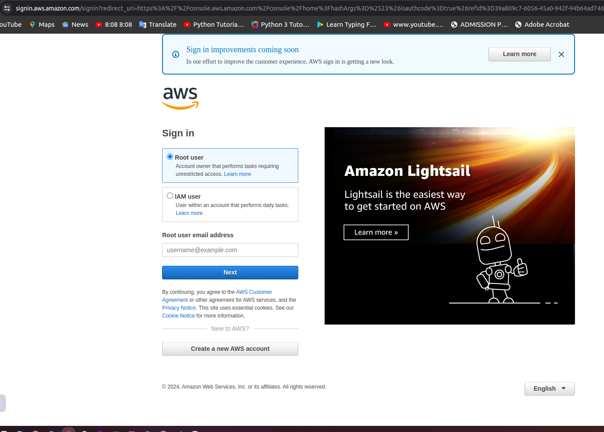
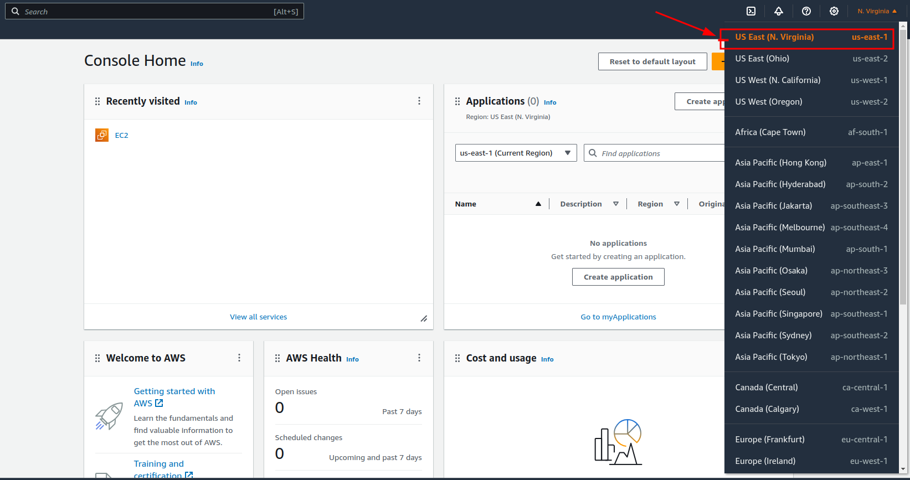
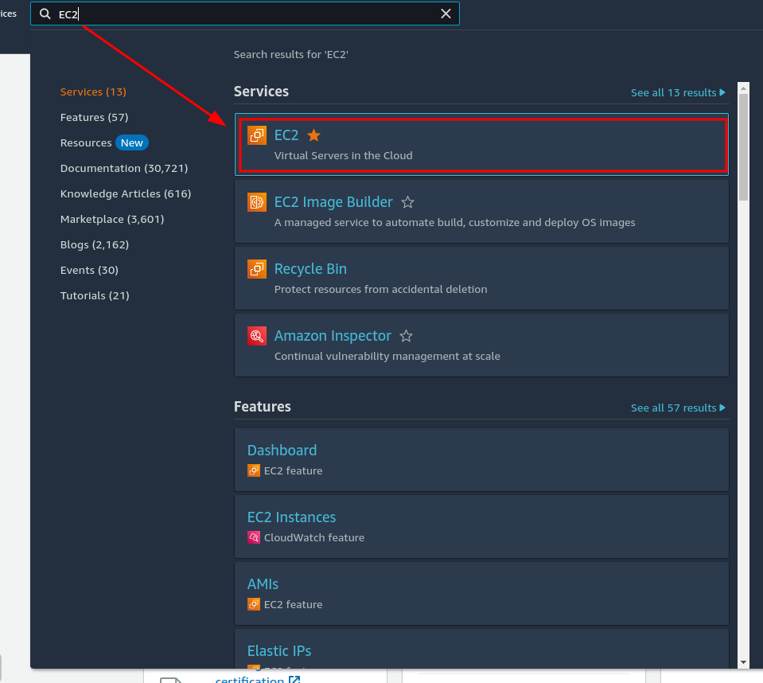
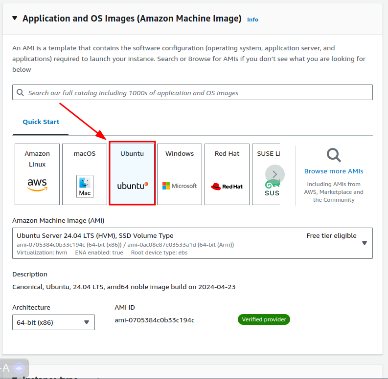
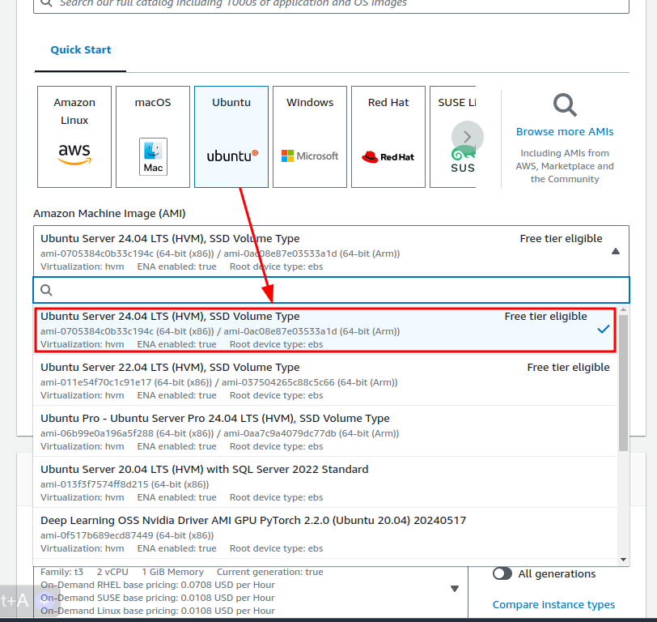
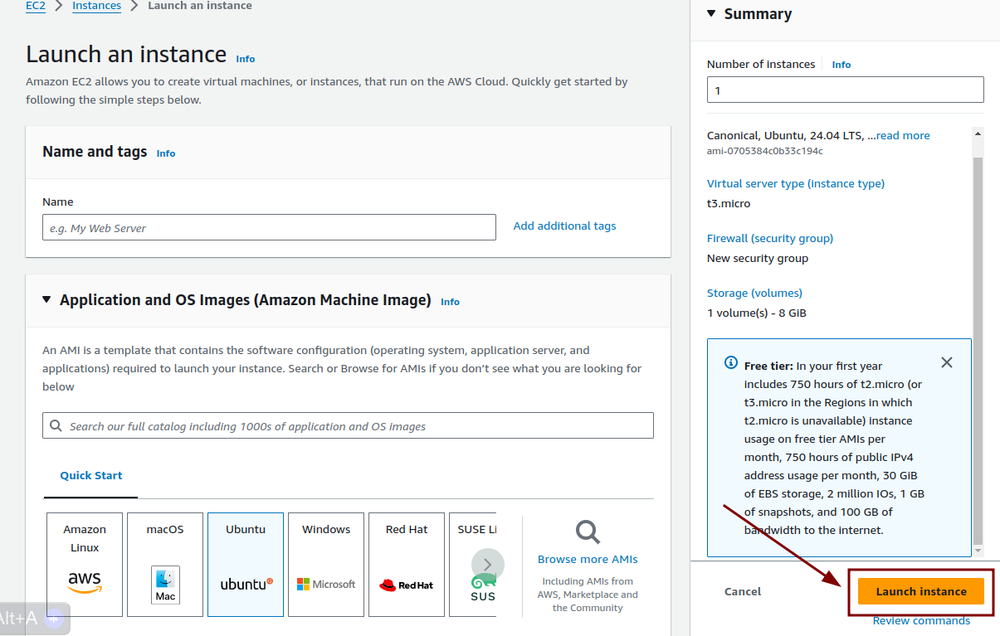
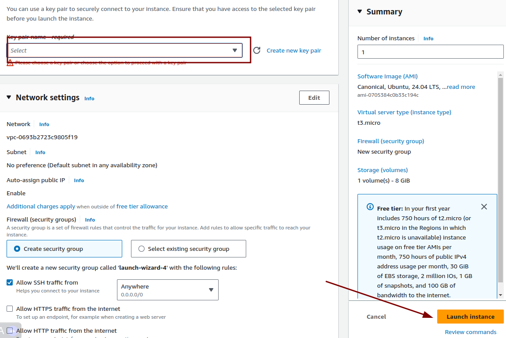
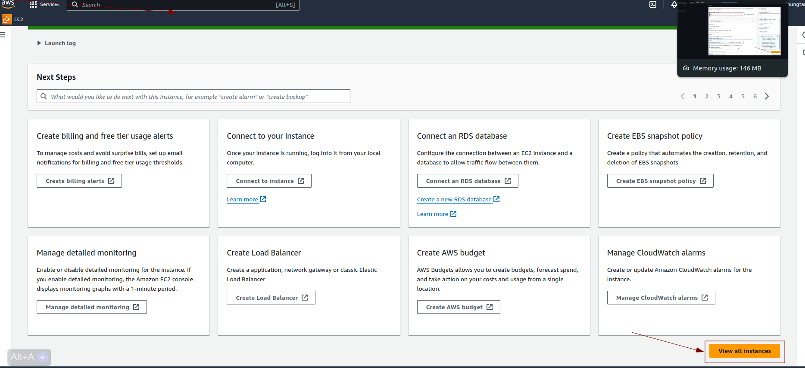
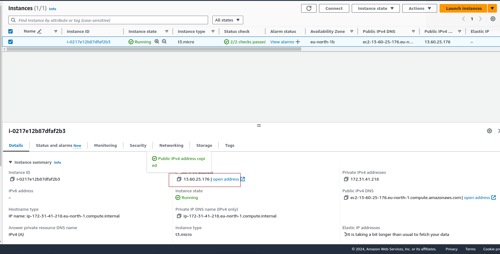
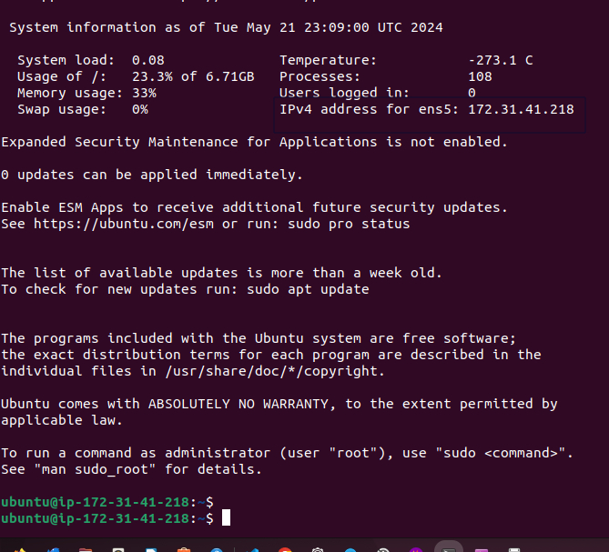

# web-stack-implementation

Hello!! This is a Web Stack Implementation Project.

What is a Web Stack?
The term "web stack" typically refers to the combination of software and technologies used to develop and run web applications. It consists of several layers(e.g. OS system, webserver, script interpreter, and database), each serving a specific purpose in the process of building and delivering web applications.One of the most popular web stacks include LAMP, which stands for **Linux, Apache, MySQL, and PHP**. The LAMP stack will be used for this project!


## LINUX

### Setting up ypur virtual environment

Linux is an operating system that manages the underlying hardware on your PC. It is an open-source software that is used worldwide. It is flexible and easy to configure.

In order to complete this project, it is necessary to set up a virtual environment. In order to achieve this, first, create a free [AWS account](https://aws.amazon.com/) and then create a virtual server using the Ubuntu Server OS. More details to come shortly!

AWS offers a Free Tier for newly registered account users. This enables users to try out some AWS services free of charge within certain usage limits. For this project, we will utilize the [EC2 (Elastic Compute Cloud)](https://aws.amazon.com/ec2/features/) service, which is covered by the Free Tier!

#### Let's get started!

Begin by registering and setting up an [AWS account](https://aws.amazon.com/) and following the directions on the screen. Once you have created your AWS account, navigate to the login page and type in your credentials.




Once you have signed-in to your AWS account, navigate to the top-right of the screen and select your preferred region (this should be the closest region to your physical location).



After you have selected your region, navigate to the search bar and type in EC2. Select the EC2 service that appears.

Next, click on "Launch Instances".

Now we are going to configure our EC2 instance! Select the Ubuntu Server 24.04 LTS (HVM) as the Amazon Machine Image (AMI).



Then, select "t3.micro" as the instance type. 


Once you have made the selection, click "Launch".


Next, you should see a window appear. Create a key pair and then select "Download". Don't lose it! You will need this file in order to connect into your server from your local PC. After you downloaded the key pair, check the box for the acknowledgement, and then click on "Launch Instances".



Great job! You've launched an EC2 instance! You can view your new instance by clicking the "View Instances" button at the bottom-right of your screen. Note: it may take a moment to initialize, so please be patient!



##### Connecting to your EC2 from your local PC

PLEASE NOTE - Anchor tags < > will be used to indicate contents what must be replaced with your unique values. For example, if you have a file named "keypair123.pem" you must enter this information within the corresponding anchor tag: < private-key-name >

Now let's connect to our instance!

Begin by opening Terminal. Once you have opened Terminal, use the ```cd ```command to change into the directory that your key pair is located. This is usually the ```~/Downloads``` directory. If you are having difficulty finding it, you can use the ```ls ```command to list the contents of your current directory.

Once you have located the key pair, use the command below to activate the key file (.pem). This command will also change permissions (otherwise you may get the error “Bad Permissions”):

```$ sudo chmod 0400 <private-key-name>.pem```


When prompted, type the password for your local PC and press Enter on your keyboard.

Next, go back to the AWS console for a moment, and navigate to your running EC2 instance. Copy the Public IP address, as shown in the image below:




Now that you've copied the Public IP address, go back to Terminal. Connect to the EC2 instance by using the command below:

``` $ ssh -i <private-key-name>.pem ubuntu@<Public-IP-address>```

Next, you will be asked if you want to continue connecting. Type ```Yes``` and press Enter on your keyboard.


To verify that you are connected, you should see your IP address on the top-right of the screen. Nice job! You have successfully connected to your Linux server in the Cloud environment.




###### APACHE


####### Installing Apache on the virtual environment

What is Apache? Apache is a widely-used fast, reliable, and secure web server software. A web server acts as a middleman between the website visitor browser and the server.

Now we will install Apache using Ubuntu’s package manager: ‘apt’ Begin by using the $ sudo apt update command to check for any available updates.

Next, run the following command to run the Apache package installation:


